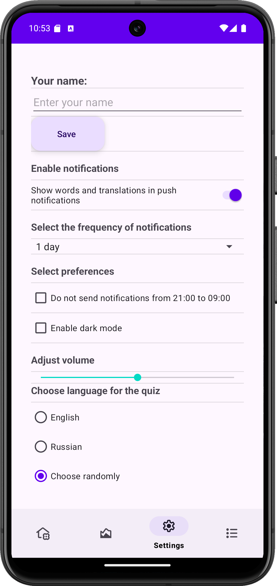

# PushWords

**PushWords** is a mobile app that helps users learn English (or any other language) through quizzes and reminders. The app comes with built-in vocabulary for all English proficiency levels, from A1 to C2. You can also upload your own text files with vocabulary to learn any language. The app tracks your progress with both bar and pie charts, allowing you to see your daily, weekly, and all-time learning progress.

### Features:
- **Quizzes**: Test your knowledge by selecting the correct translation.
- **Custom vocabulary**: Upload your own text files with words to learn any language.
- **Built-in vocabulary**: Pre-installed words for all levels of English (A1-C2).
- **Progress tracking**: View your learning progress with bar and pie charts.
- **Push notifications**: Receive reminders to continue learning with the help of push notifications.
- **Real-time sync**: Your vocabulary and progress are always up to date.

### Technologies used:
- **Jetpack Navigation**, **Hilt**, **MVVM**, **Multi-module structure**, **WorkManager**, **Datastore**, **Room**, **Coroutines**, **MPAndroidChart**.

---

## Русский

**PushWords** — это мобильное приложение, которое помогает пользователям изучать английский (или любой другой язык) с помощью квизов и напоминаний. Приложение содержит встроенный словарь для всех уровней владения английским языком (A1-C2). Вы также можете загружать собственные текстовые файлы со словами для изучения любого языка. PushWords отслеживает ваш прогресс с помощью столбчатой и круговой диаграмм, позволяя видеть ваш ежедневный, недельный и общий прогресс.

### Возможности:
- **Квизы**: Проверяйте свои знания, выбирая правильный перевод.
- **Пользовательский словарь**: Загружайте собственные текстовые файлы со словами для изучения любого языка.
- **Встроенный словарь**: Предустановленные слова для всех уровней английского языка (A1-C2).
- **Отслеживание прогресса**: Смотрите свой прогресс с помощью столбчатой и круговой диаграмм.
- **Пуш-уведомления**: Получайте напоминания для продолжения изучения с помощью пуш-уведомлений.
- **Реальная синхронизация**: Ваш словарь и прогресс всегда актуальны.

### Использованные технологии:
- **Jetpack Navigation**, **Hilt**, **MVVM**, **Многомодульная структура**, **WorkManager**, **Datastore**, **Room**, **Coroutines**, **MPAndroidChart**.

---

### Screenshots / Скриншоты

- **Progress Screen / Экран прогресса**  
  

- **Add Words to Dictionary / Экран добавления слов в словарь**  
  

- **Quiz Answer Selection Screen / Экран выбора ответа (квиза)**  
  

- **Quiz Answer Selection Screen / Экран выбора ответа (квиза)**  
  

- **My Vocabulary (User's) / Мой словарь (пользователя)**  
  

- **Settings Screen / Экран настроек**  
  

- **Progress Screen / Экран прогресса**  
  
